# Teórica 19 (SIN) - 8/4/2026

## Presentación UML-Tipos de diagramas
### **Tema: El Universo UML**

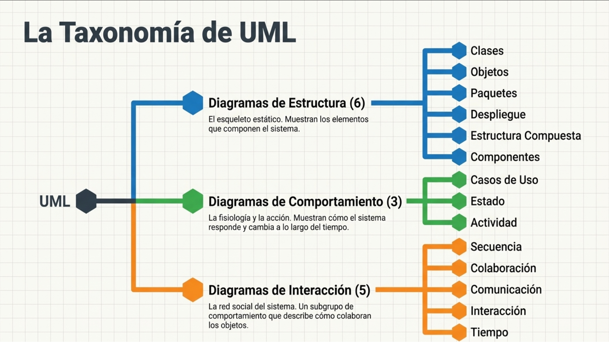

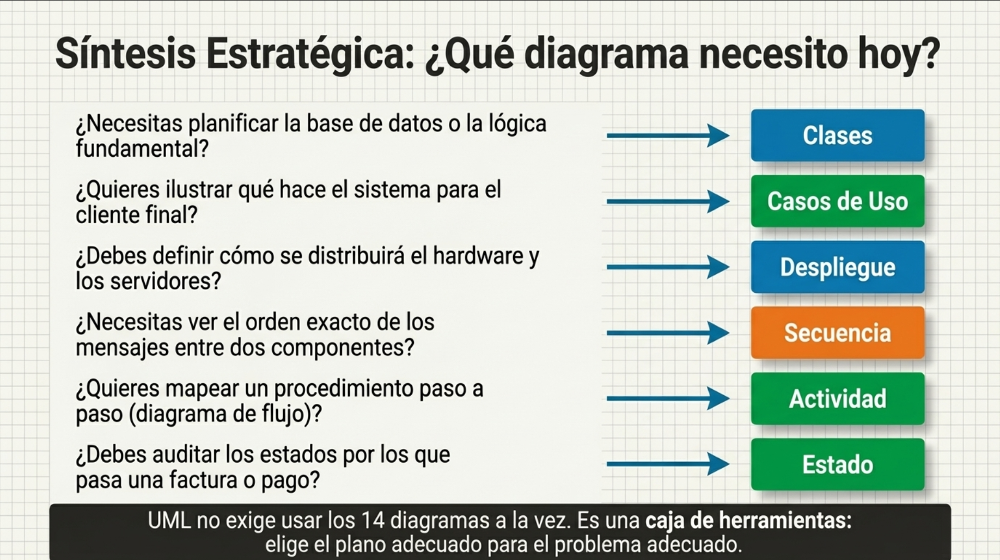

UML no exige usar los 14 diagramas a la vez. Es una **caja de herramientas:** elige el plano adecuado para el problema adecuado.

---

## Presentación DFD
### **Tema: DFD's Diagramas de Flujo de Datos**
#### Diagrama de Flujo de Datos (DFD)

Es la connotación de un diagrama en forma de red que representa el flujo de datos y las transformaciones que se aplican sobre ellos al moverse desde la entrada hasta la salida del sistema.

#### Procesos

Puede interpretarse como una función que debe llevar a cabo el sistema. Debe ser capaz de generar los flujos de datos de salida a partir de los flujos de datos de entrada y de una información local.

Un proceso se identifica mediante un número y un nombre, que deben ser únicos en el conjunto de DFD's que representan el sistema. El nombre debe
ser breve y lo más representativo posible de la función que describe. Normalmente se forma por un verbo y un sustantivo.

#### Almacen de datos

Representa información del sistema almacenada en forma temporal.

Es un depósito lógico de almacenamiento que puede representar distintos tipos de información física (una bandeja con papeles, un archivador manual, un archivo en una computadora o una base de datos).

#### Entidad

Una Entidad externa representa un generador o consumidor de información del sistema, pero no pertenece al mismo

Puede representar un subsistema, persona, departamento, organización, etc.., que proporcione datos al sistema o que los reciba de él.

Los flujos que parten de o llegan a las entidades externas definen la interfaz entre el sistema y el mundo exterior.

#### Entidades Externas

Normalmente, las entidades externas sólo deberían aparecer en el diagrama de mayor nivel (Diagrama de Contexto).

Pueden incluirse en otros niveles si mejoran la legibilidad de los diagramas.

Toda entidad externa se identifica con un nombre.

#### Flujo de Datos

Se interpretan como un camino a través del cual viajan datos de composición conocida de una parte del sistema a otra.

Son el medio de conexión de los restantes componentes del DFD. Se representan por arcos dirigidos, en donde la flecha indica la dirección de los datos.

Deben tener un nombre o rótulo que los identifique.

Los flujos de datos que conectan componentes de un DFD deben respetar las siguientes restricciones:

| Origen / Destino  | Proceso | Almacén | Entidad externa |
|-------------------|---------|---------|-----------------|
| Proceso           | Sí      | Sí      | Sí              |
| Almacén           | Sí      | No      | No              |
| Entidad externa   | Sí      | No      | No              |

Las diferentes conexiones entre procesos y almacenes que es posible realizar son:

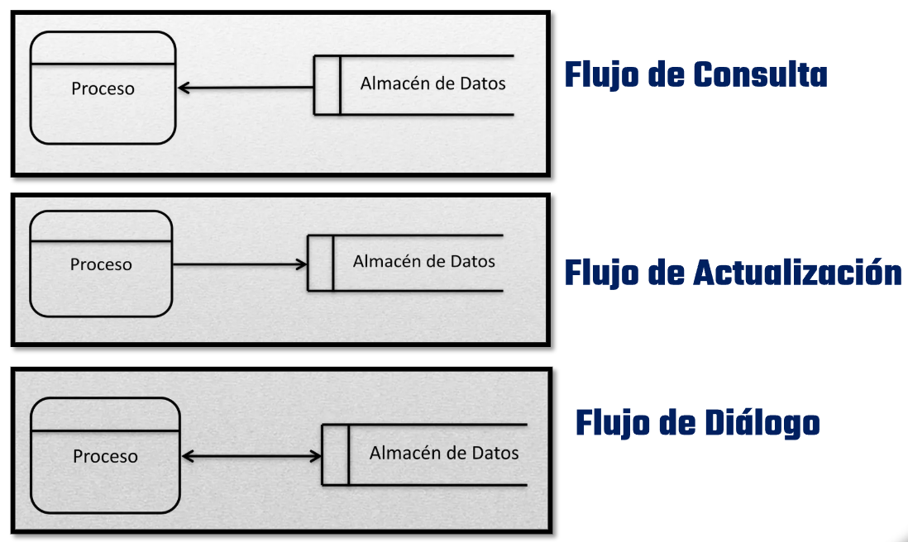

#### Descomposición de Niveles en un DFD

##### Diagrama de Contexto

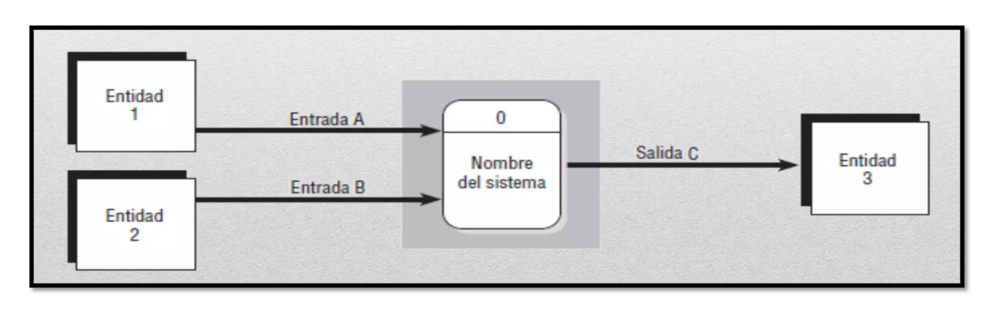

Es el DFD más general de todos.

Está formado por un solo macro proceso (el sistema), las entidades externas (fuentes y destinos) y sus relaciones con el macro proceso.

Delimita el sistema y sus relaciones con el macro proceso.

##### Diagrama Nivel 0 [Sistema]

El Diagrama 0 es la ampliación del diagrama de contexto y puede incluir hasta nueve (9) procesos. Si se incluyen más procesos en este nivel se producirá un diagrama difícil de entender.

Por lo general, cada proceso se numera con un entero, empezando en la esquina superior izquierda del diagrama y terminando en la esquina inferior derecha.

En el Diagrama 0 se incluyen los principales almacenes de datos del sistema (que representan a los archivos mestros) y todas las entidades externas.

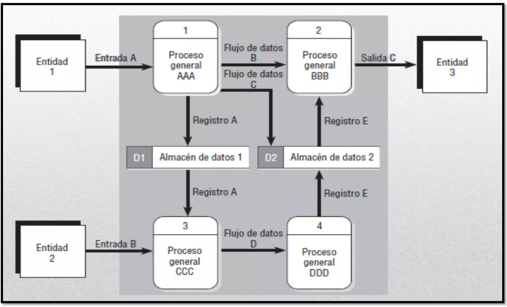

##### Diagramas Hijos [Subprocesos]

Cada proceso del Diagrama 0 se puede, a su vez, ampliar para crear un diagrama hijo más detallado. El proceso del Diagrama 0 a partir del cual
se realiza la ampliación se llama proceso padre, y el diagrama que se produce se llama diagrama hijo.

La regla principal para crear diagramas hijos, el equilibrio vertical, estipula que un diagrama hijo no puede producir salida o no puede recibir
entrada que el proceso padre no produzca o reciba también.

Todos los flujos de datos hacia dentro o hacia fuera del proceso padre se deben mostrar fluyendo hacia dentro o hacia fuera del diagrama hijo.

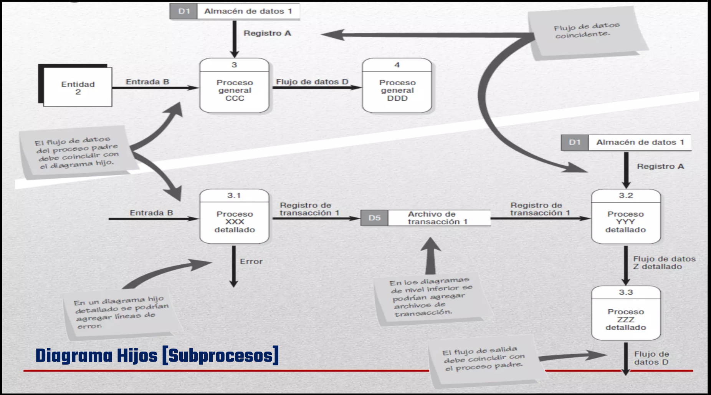

#### Para construir un DFD

Nombrar adecuadamente todos los objetos del DFD.

Numerar adecuadamente procesos y diagramas.

Realizar una correcta división en subsistemas (Contextual, Nivel 0,1,2...).

Utilizar la descomposición funcional jerárquica hasta alcanzar las funciones primitivas.

---

## Presentación Ejemplos de los diagramas solicitados
### **Tema: Ejemplos de diagramas solicitados en su Modelado de Datos**
#### Diagrama de Secuencia

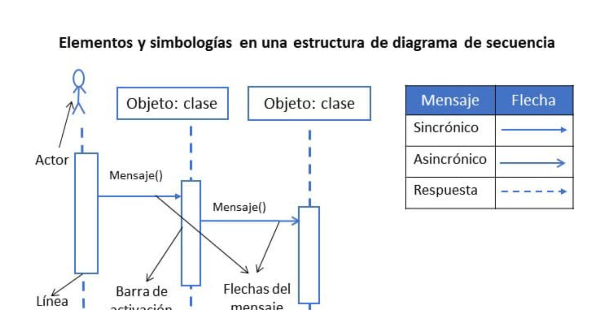

#### Diagrama de Clases

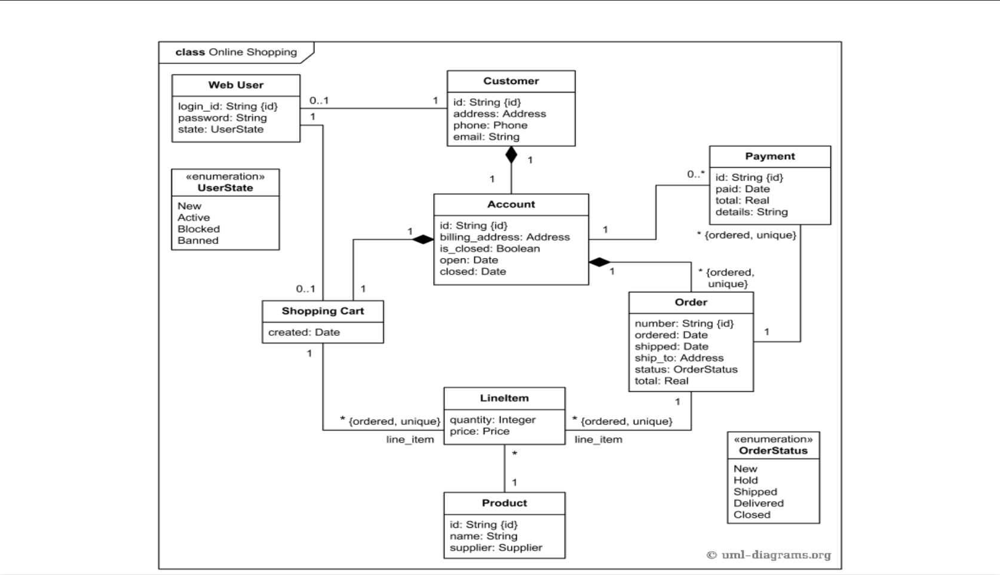

#### Diagrama de Actividades

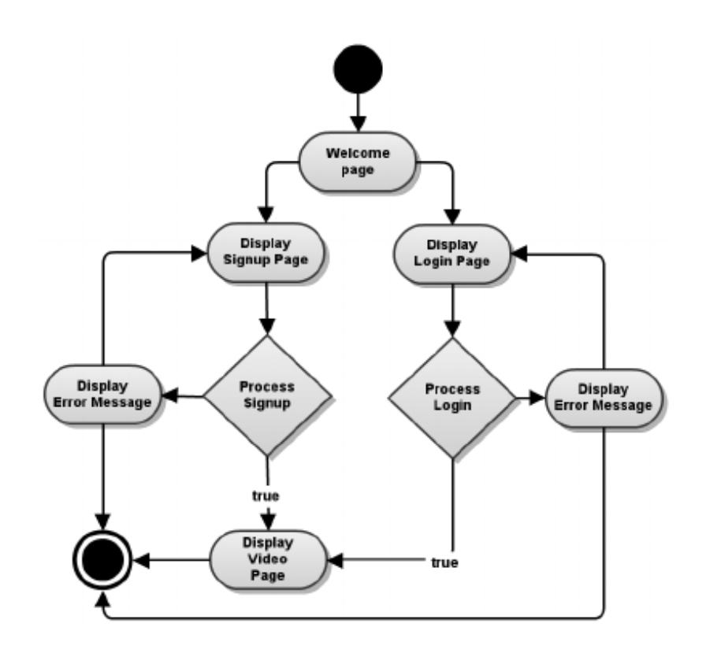

#### Diagrama de Estado

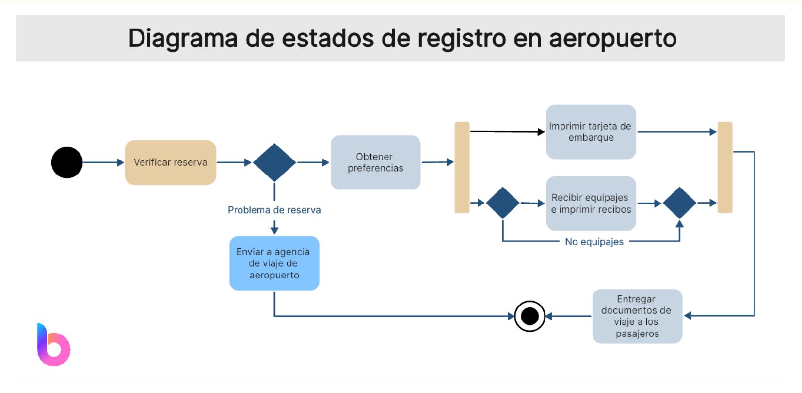

#### Diagrama de componentes

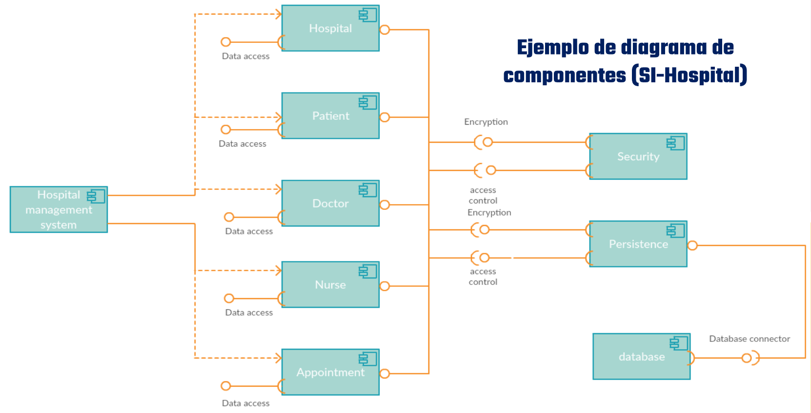

#### Diagrama de arquitectura del Sistema

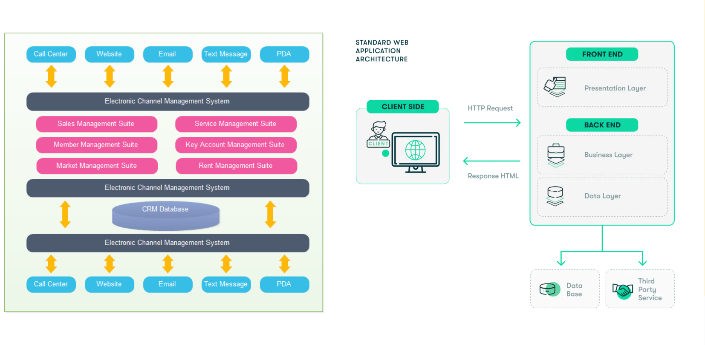

#### Diagrama de Entidad Relación

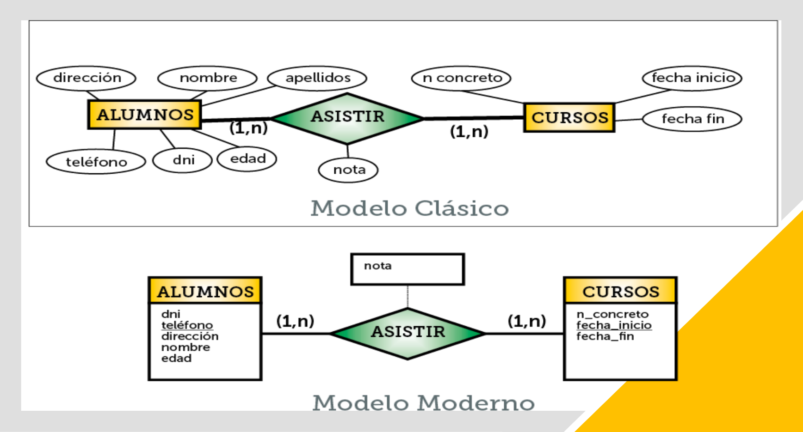

#### Diccionario de Datos

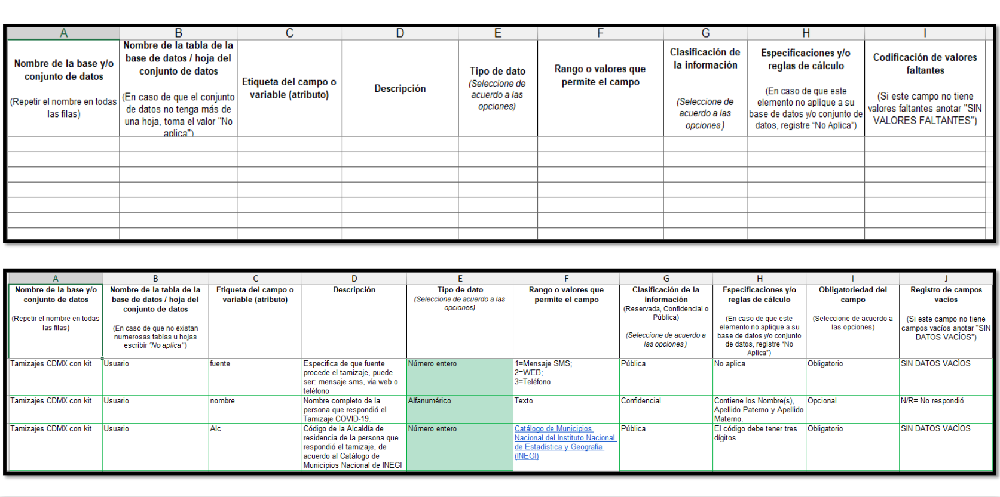

#### Casos de Uso

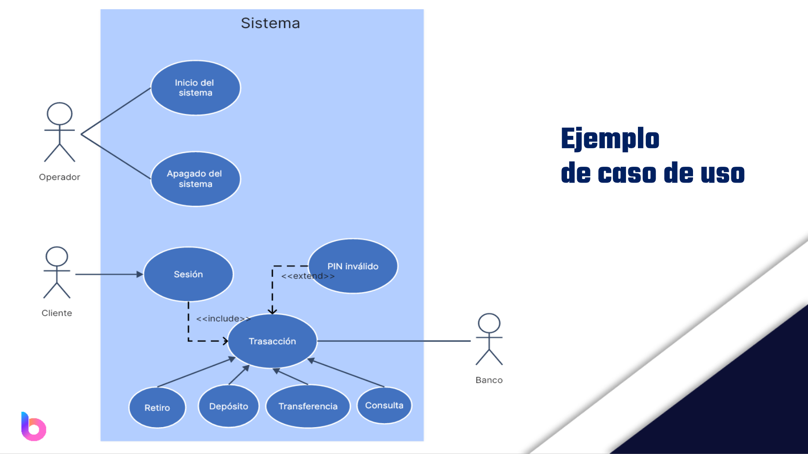

#### Diagrama de Carriles swimlane

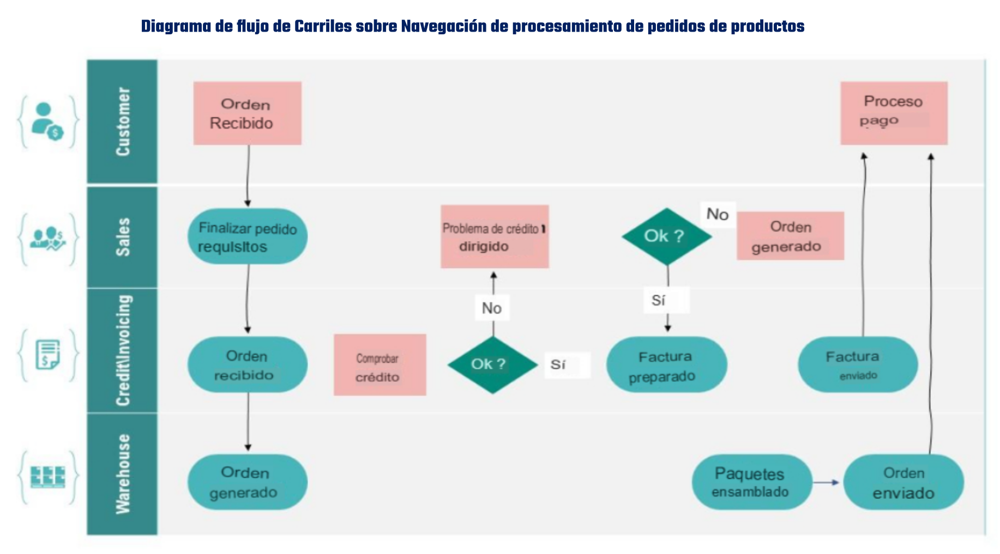