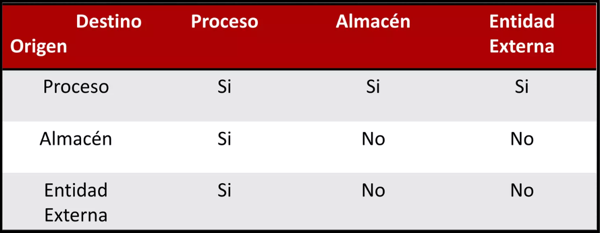
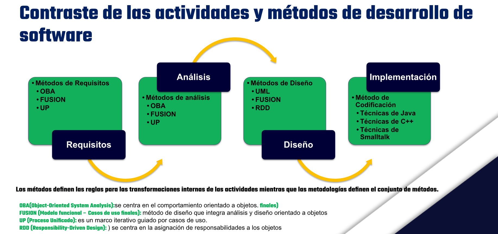

# Segundo Parcial (SIN) - 23/4/2026
## Segundo Parcial (50%)
### Resuelto

**Indicaciones:** El Parcial consta de **5 ítems**, que responderá en cada planteamiento. Está diseñado para ser resuelto de manera individual en 100 minutos. Lean y resuelvan correctamente la evaluación, según lo estudiado y discutido en clase, sobre la Fase de diseño de Software, informáticos, Systems Development Life Cycle, implementación del Modelado de Datos y documentación de Manual del Analista. **Escriba con lapicero azul y letra legible y** *aplicar normas ortográficas en la correcta escritura* **en los ítems que lo requieren.** 
**Todo intento de copia anulará su evaluación según el reglamento institucional.**

---

**Ítem 1.** (3 puntos) Diligenciar lo indicado. Escriba la respuesta correcta.

1.- ¿Qué define una 'Metodología' en comparación con un 'Método'? 
**Una metodología es el conjunto de métodos que definen las actividades del ciclo de vida.** 
**Las metodologías agrupan diversos métodos para organizar el proceso completo de desarrollo.**

2.- ¿Qué actividad de la fase de análisis implica el uso de diagramas como DFD o UML? 
**Modelado de procesos.** 
**El modelado utiliza representaciones gráficas para entender cómo fluye la información y cómo funcionan los procesos.**

3.- En el contexto de la ingeniería de requerimientos, ¿qué significa que un requerimiento tenga 'Verificabilidad'? 
**Que el requerimiento está escrito de tal forma que se puede comprobar si el sistema lo cumple.** 
**Un requerimiento verificable permite diseñar pruebas claras para confirmar su cumplimiento.**

4.- La fase de 'Modelado' en el marco del proceso de software tiene como objetivo principal: 
**Crear modelos que permitan al desarrollador y al cliente entender los requisitos y el diseño.** 
**El modelado facilita la comunicación y comprensión de cómo la solución satisfará las necesidades.**

5.- ¿A qué se refiere el término 'Gestión de Requerimientos'? 
**Al proceso de comprender y controlar los cambios en los requerimientos del sistema.** 
**La gestión asegura que los cambios durante el desarrollo se manejen de forma ordenada y trazable.**

6.- ¿Cuál es la composición recomendada para el nombre de un Proceso? 
**Un verbo seguido de un sustantivo.** 
**Esta estructura describe claramente la acción (función) que se realiza sobre un objeto o dato específico.**

---

**Ítem 2.** (1.5 puntos) Complete la tabla con los datos correspondientes a las restricciones de los flujos de datos con respecto a las conección entre preoceso, Almacén de datos y Entidad Externa en este orden mencionado tanto en origen como en destino.

---

**Ítem 3.** (1.5 puntos) **Escribir la letra V (verdadero) o F (Falso) según corresponda a cada enunciado, en los casos solicitado, explique el ¿por qué? de su respuesta.**

1.- **V** Es "estudio de viabilidad" es la actividad con la que debería empezar el proceso de ingeniería de requerimientos para todos los sistemas nuevos. 
2.- **F** Definir el alcance y los objetivos mediante la recopilación y examen de información del negocio, no es el propósito primordial de la Fase de Análisis de Sistemas dentro del ciclo de vida del desarrollo de software. 
         ¿Por qué? 
         *Los Enterprise Resource Planning (ERP), integran diferentes áreas de la organización y facilitan el manejo de grandes volúmenes de información, permitiendo así centralizar y gestionar toda la información que fluye internamente entre departamentos.* 
3.- **F** En el contexto de costos de un proyecto de software, la gestión del proyecto y costos de oficina se clasifica como costo directo. 
         ¿Por qué? 
         *El usuario es el que usará el sistema a diario* 
4.- **F** El concepto de 'Equilibrio Vertical' en la descomposición de DFDs estipula que: Un diagrama hijo puede recibir entradas que el proceso padre no reciba originalmente. 
5.- **F** Las entidades externas en los Diagramas de flujos de datos pueden representar personas, departamentos pero no por otros sistemas que intercambian información.

---

**Ítem 4.** (2 puntos) Complete el diagrama relacionado al Contraste de las actividades y métodos de desarrollo de software (en orden).

---

**Ítem 5.** (2 puntos) Estructure el diagrama de secuencias de su Sistema Informático y pero antes coloque toda la simbología estándar para este tipo de diagrama independientemente de si la utilizó o no para sus deseños, con sus respectivos nombres. (Escriba legiblemente). Si diseño varios por módulo dibuje 1.

| **SÍMBOLOS BÁSICOS** | **NOMBRE** | **SÍMBOLOS COMUNES DE MENSAJES** | **NOMBRE** |
|----------------------|------------|----------------------------------|------------|
| Actor                | Usuario    | Mensaje de llamada               | Llamada    |

**Diseño de su diagrama al reverso de la página en horizontal:**

>El diagrama de secuencias no me tocó a mi, por lo que no tengo la imagen de referencia