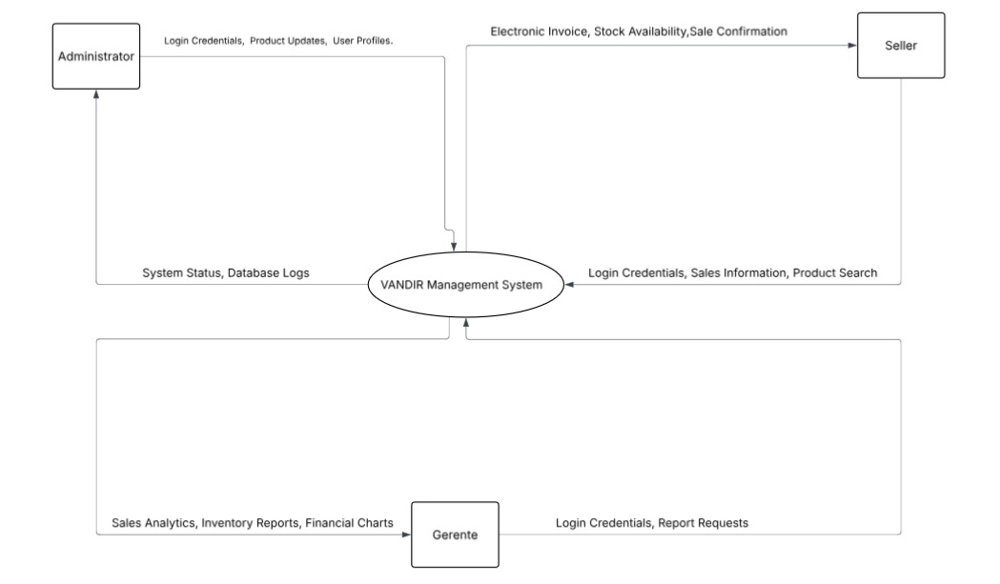
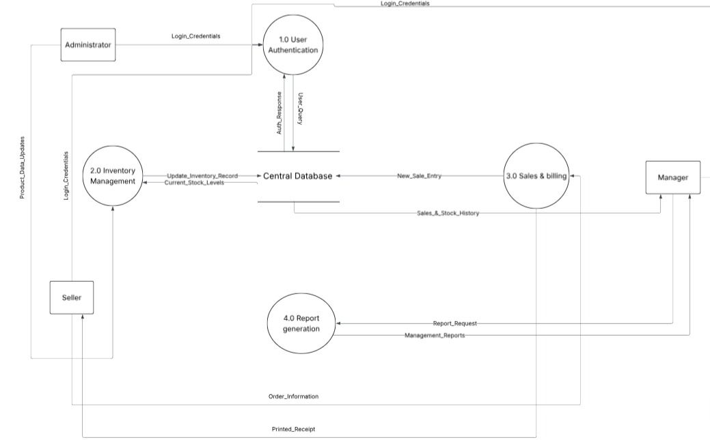
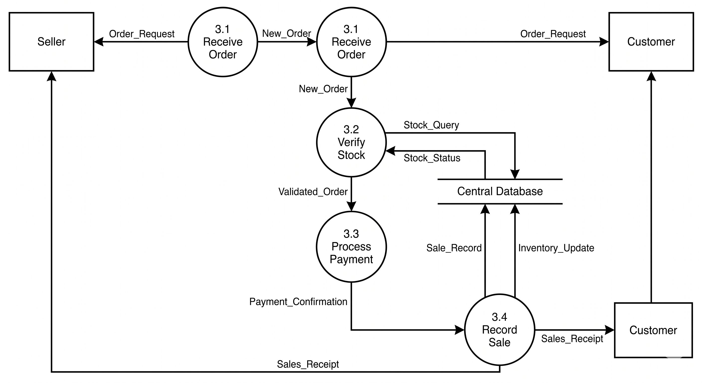
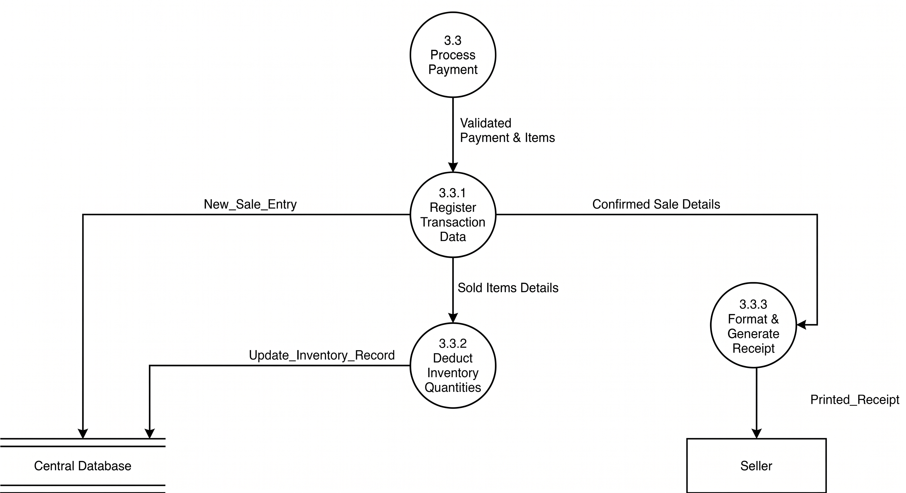

# Teórica 24 (SIN) - 30/4/2026

Corregir **Manual del Analista**.

En mi caso, corregir el DFD nivel 1 y 2, usando el formato "Yourdon/De Marco". Y para pulir el formato de [Eraser](https://www.eraser.io/), usé **Gemini**.

## DFD de contexto y nivel 0

>No los hice yo, pero los guardo como ejemplo





## DFD de nivel 1



```eraser
// DFD Nivel 1 - 3.0 Sales & billing
// External Entities
Seller [shape: rectangle, label: "Seller"]
Customer [shape: rectangle, label: "Customer"]

// Sub-processes of 3.0 (Formato Yourdon/De Marco: Círculos)
P3_1 [shape: circle, label: "3.1\nReceive\nOrder"]
P3_2 [shape: circle, label: "3.2\nVerify\nStock"]
P3_3 [shape: circle, label: "3.3\nProcess\nPayment"]
P3_4 [shape: circle, label: "3.4\nRecord Sale\n& Emit Receipt"]

// Data Store (De Nivel 0)
DB [shape: cylinder, label: "Central Database"]

// Data Flows
Customer > Seller: Product Request (Physical)
Seller > P3_1: Order_Information
P3_1 > P3_2: Item Details to Check

// Inventory verification loop
DB > P3_2: Current_Stock_Levels
P3_2 > Seller: Stock Status (Available / Out of Stock)

// Payment and System Entry
P3_2 > P3_3: Confirmed Items for Sale
Customer > Seller: Cash Payment (Physical)
Seller > P3_3: Confirm Payment Receipt
P3_3 > P3_4: Payment Confirmation

// Final Database updates and output (Matches Level 0 flows)
P3_4 > DB: New_Sale_Entry
P3_4 > DB: Update_Inventory_Record
P3_4 > Seller: Printed_Receipt
Seller > Customer: Deliver Product & Receipt
```

## DFD de nivel 2



```eraser
// DFD Nivel 2 - Subproceso 3.3
// Entities and Data Sources outside this specific sub-process
Seller [shape: rectangle, label: "Seller"]
P3_3 [shape: circle, label: "3.3\nProcess\nPayment"]

// Sub-processes of 3.3 Record Sale & Emit Receipt (Círculos)
P3_3_1 [shape: circle, label: "3.3.1\nRegister\nTransaction Data"]
P3_3_2 [shape: circle, label: "3.3.2\nDeduct\nInventory Quantities"]
P3_3_3 [shape: circle, label: "3.3.3\nFormat &\nGenerate Receipt"]

// Data Store (From Level 0)
DB [shape: cylinder, label: "Central Database"]

// Data Flows
// The flow comes from the previous payment process
P3_3 > P3_3_1: Validated Payment & Items

// Database entries
P3_3_1 > DB: New_Sale_Entry
P3_3_1 > P3_3_2: Sold Items Details
P3_3_2 > DB: Update_Inventory_Record

// Receipt generation
P3_3_1 > P3_3_3: Confirmed Sale Details
P3_3_3 > Seller: Printed_Receipt
```

>Se corrigieron la numeración de los procesos