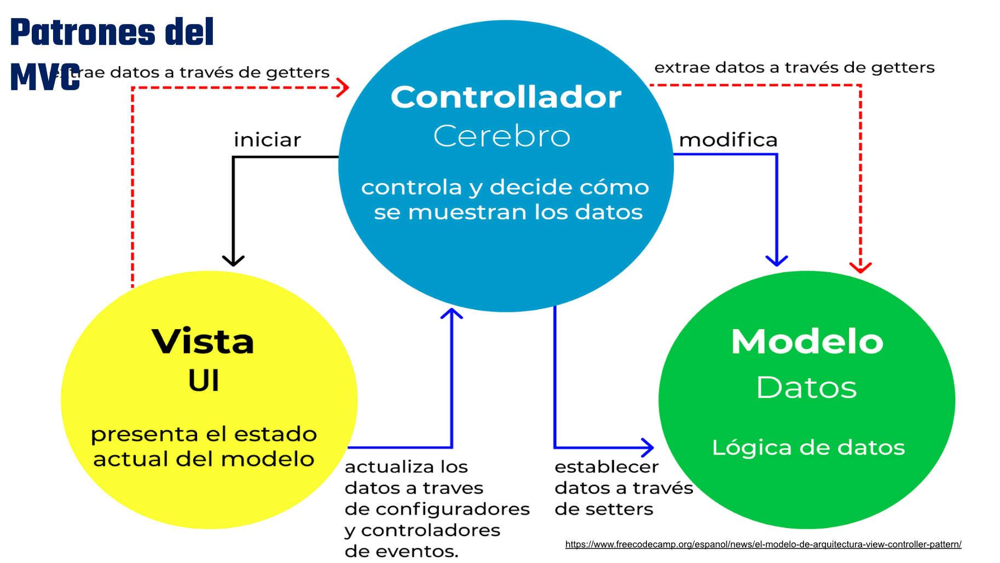
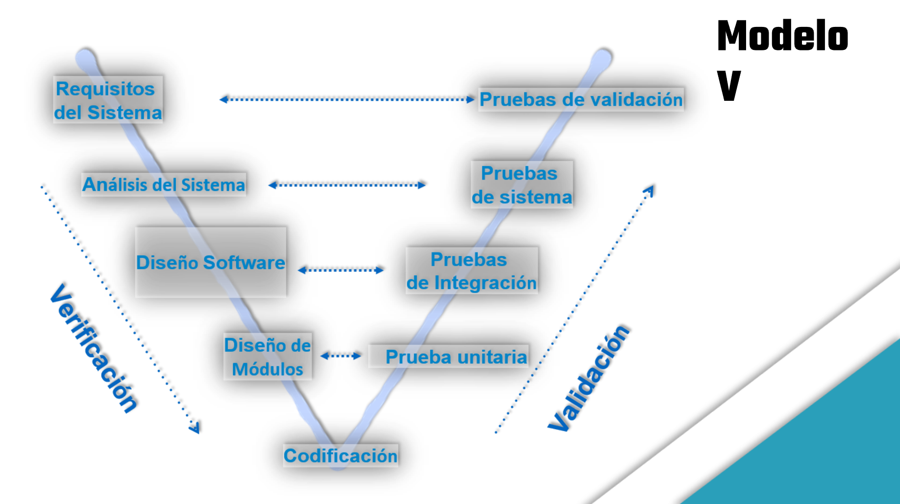

# Primer Parcial (SIN) - 5/3/2026
## Primer Parcial (50%)
### Resuelto

**Indicaciones:** El parcial consta de **5 ítems**, que responderá en cada planteamiento. Está diseñado para ser resuelto de manera individual en 100 minutos. Lean y resuelvan correctamente la evaluación, según lo estudiado y discutido en clase, sobre tipos de sistemas informáticos, Metodologías de desarrollo de Software y Systems Development Life Cycle. **Escriba con lapicero azul y letra legible los ítems donde se requiere de su escritura.**

---

**Ítem 1.** (3 puntos) Diligenciar lo indicado. Escriba la respuesta correcta.

1.- Dentro de un documento de requisitos, ¿en qué sección se suelen enumerar las restricciones de software que pueden excluir opciones de desarrollo? 
**En la sección de "Especificación Formal de Requerimientos", que en el Modelo en Cascada sigue al Análisis de Requerimientos.**

2.- Según el material sobre el Ciclo de Vida del Software, ¿cuáles son las tres etapas que más influyen en el aseguramiento de la calidad final? 
**Requerimientos, Diseño y prototipo, y Prueba.**

3.- ¿Qué caracteriza fundamentalmente al Modelo Incremental o Evolutivo en comparación con el Modelo en Cascada? 
**El Modelo Incremental entrega el sistema en **versiones sucesivas**, donde cada versión añade nuevas funcionalidades. A diferencia del Modelo en Cascada, que sigue un flujo lineal y secuencial hasta entregar el producto completo al final, el Incremental permite al usuario recibir y usar partes funcionales del sistema desde etapas tempranas del desarrollo.**

4.- ¿Para qué tipo de escenarios es considerado 'bueno' o adecuado el uso del Modelo Big Bang? 
**Para aprender y experimentar. Es adecuado para proyectos pequeños de práctica, proyectos académicos o situaciones donde el desarrollador trabaja solo y los requisitos son mínimos o no definidos formalmente.**

5.- Al considerar los objetivos de una metodología, ¿cómo ayuda esta a facilitar el mantenimiento posterior de los sistemas? 
**Uno de los objetivos explícitos de las metodologías es **"Facilitar el mantenimiento posterior de los sistemas"**. Lo logra al exigir documentación formal en cada fase (manuales, especificaciones, diagramas), estructurar el código de forma organizada y definir responsables claros. Así, cuando el sistema requiere correcciones o actualizaciones, el equipo de mantenimiento puede entender rápidamente la arquitectura y los procesos del sistema.**

6.- En el modelo incremental, ¿cuál es la relación entre la Versión #1 y la Versión #2? 
**La versión #2 es una mejora de la versión #1**

---

**Ítem 2.** (1.5 puntos) **Coloque el nombre de su proyecto y en las fases del ciclo de vida del Desarollo de Sistema, que se le presentan a continuación, escriba una de las tareas que usted determinó en el cronograma de su proyecto.**

**NOMBRE DEL PROYECTO:**    Sistema de Inventario 

| **FASE**                    | **TAREA**                          |
|-----------------------------|------------------------------------|
| **Desarrollo**              | Creación de módulo de usuarios     |
| **Pruebas y Despliegue**    | Instalación del sistema al cliente |

---

**Ítem 3.** (1.5 puntos) **Escribir la letra V (verdadero) o F (Falso) según corresponda a cada enunciado, en los casos solicitado, explique el ¿por qué? de su respuesta.**

1.- **F** El concepto original de MVC fue propuesto por Trygve Reenskaug para el desarrollo de interfaces gráficas de aplicaciones de escritorio. 
2.- **V** Los 'Sistemas de Colaboración Empresarial' permiten a las compañías gestionar la gran cantidad de información que circula internamente. 
         ¿Por qué? 
         *Los Enterprise Resource Planning (ERP), integran diferentes áreas de la organización y facilitan el manejo de grandes volúmenes de información, permitiendo así centralizar y gestionar toda la información que fluye internamente entre departamentos.* 
3.- **F** En la definición técnica de un Sistema Informático (), el usuario es el elemento que posee el control total sobre lo que sucede en el sistema. 
         ¿Por qué? 
         *El usuario es el que usará el sistema a diario* 
4.- **V** Los requisitos 'no funcionales' son aquellos que definen el entorno técnico y las cualidades de calidad del sistema, siendo usualmente responsabilidad del analista. 
5.- **V** Los sistemas de información ejecutiva (EIS) presentan la información de acuerdo con la necesidad de profundizar que tenga el usuario.

---

**Ítem 4.** (2 puntos) **Complete desde el título y los elementos faltantes en el siguiente diagrama.**

---

**Ítem 5.** (2 puntos) **Complete desde el título y los elementos faltantes en el siguiente diagrama.**

