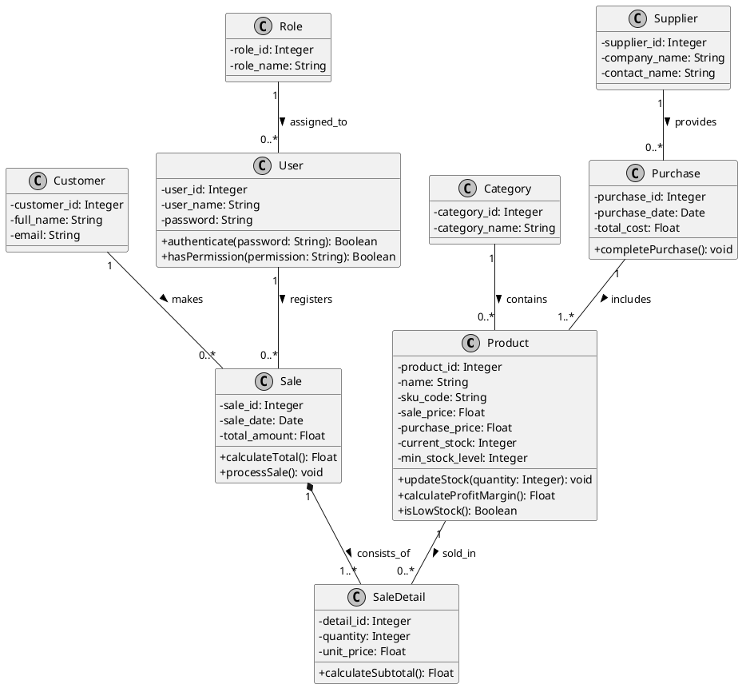

# Teórica 14 (SIN) - 12/3/2026

Se terminó:
* Digrama Entidad Relación
* Diagrama de clases (me tocó a mí)

---

## Diagrama Entidad Relación

Hecho en **Lucidchart**: `Diagrama en blanco.png`

## Diagrama de clases

Hecho en [PlantText](https://www.planttext.com/):
* Diagrama en formato **PNG**: `Diagrama de clases SIN-A.png`
* Diagrama en formato UML: `diagrama_clases_plantuml_export.puml`

### Imagen

### Código UML

