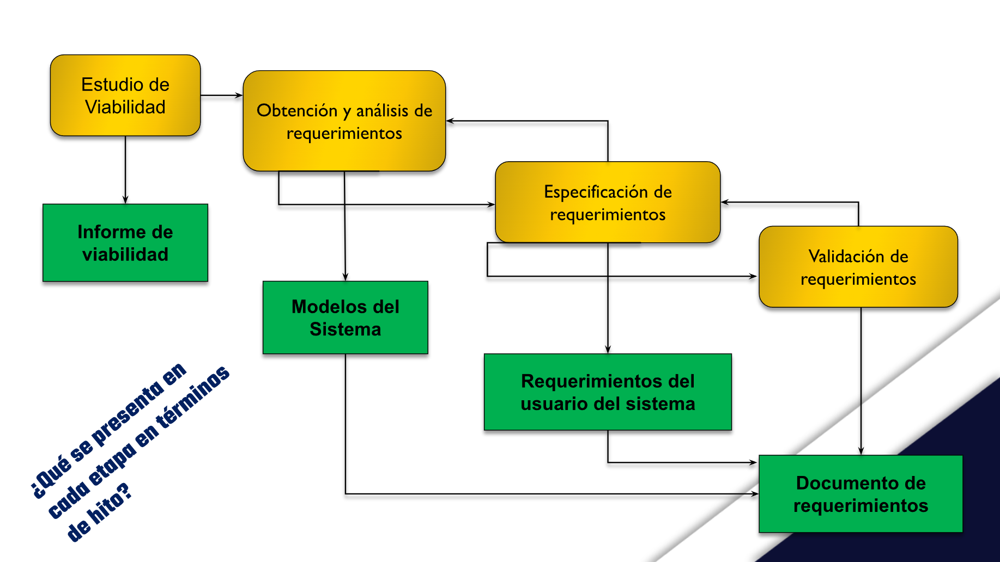
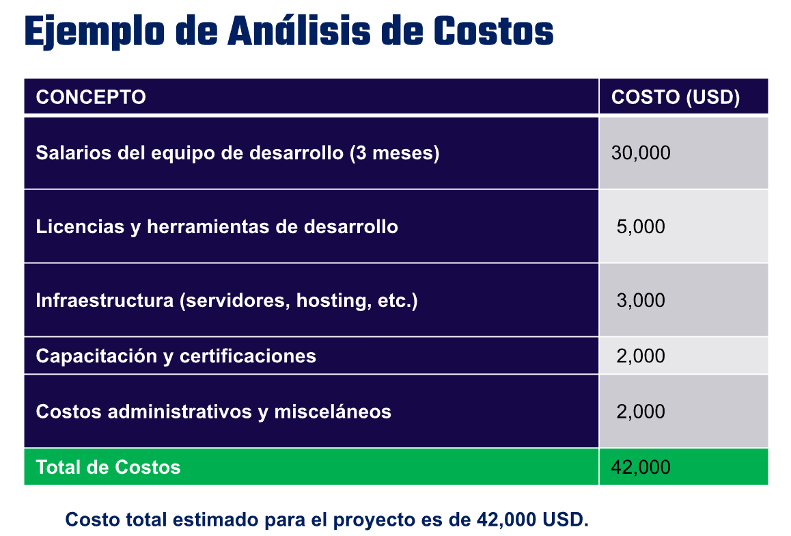
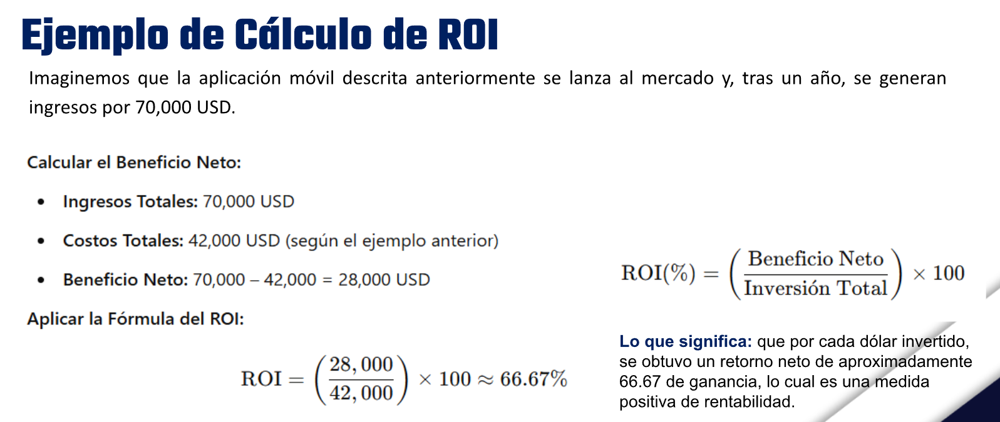
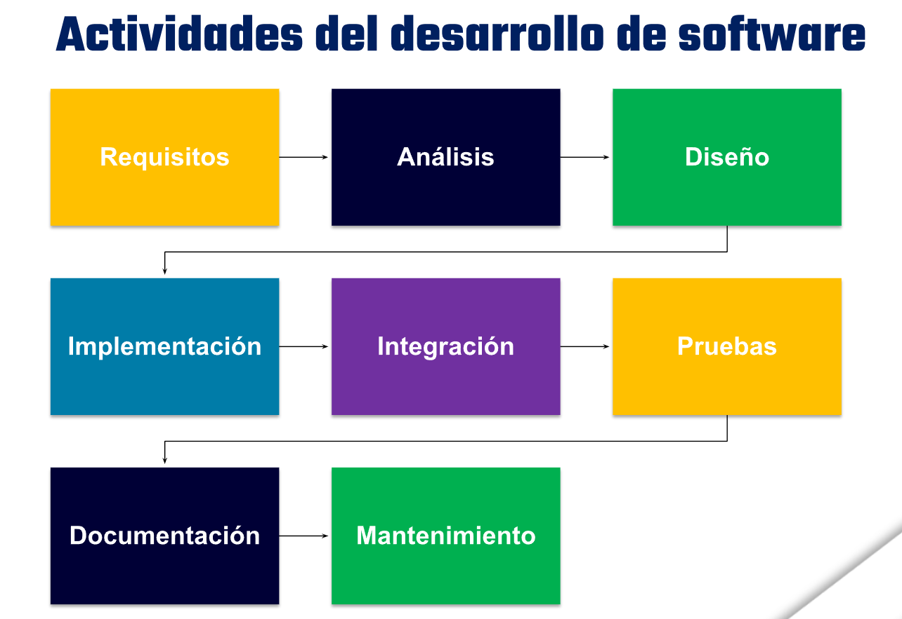
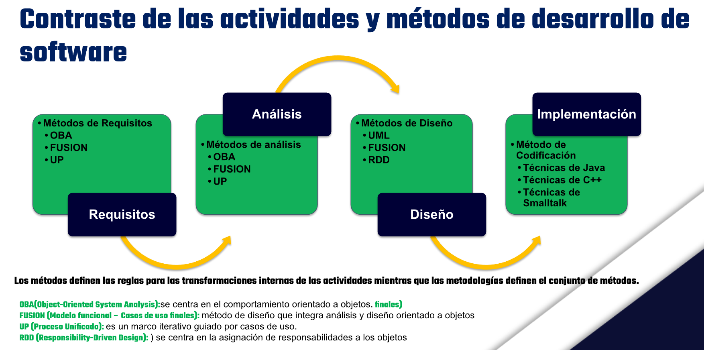

# Teórica 15 (SIN) - 18/3/2026
## 1SP-Presentación Intro a Unidad II-Planeación y Desarrollo de Los SI
### **Tema: Planeación y Desarrollo de Los Sistemas Informáticos 1.- Fase de Análisis de Sistemas.**

#### Objetivo:

Aplicar las fases iniciales del ciclo de vida del software, enfocándose en la planeación y el desarrollo de sistemas informáticos, desde el análisis hasta la viabilidad del proyecto.

#### Fase Análisis de Sistemas

Es la etapa en la que se recopila y examina la información necesaria para comprender los procesos, problemas y oportunidades del negocio, definiendo el alcance y objetivos del sistema. Actividades clave:

1. Identificación de los procesos actuales.
2. Modelado de procesos con diagramas (p.ej., DFD, UML).
3. Identificación de actores y partes interesadas.

#### A) Técnicas para recopilación de datos y análisis del entorno
##### Técnicas de investigación o búsqueda de información

Una técnica **es un método que aplica herramientas y reglas específicas para completar una o más fases del ciclo de vida del desarrollo de sistemas**.

Estas *técnicas* se pueden usar de manera combinada:
* **Muestreo.**
* **Entrevistas**
* **Cuestionarios auto Administrados.**
* **Observación.**
* **Revisión de Documentos.**

##### Técnicas para la Recopilación de Datos y Análisis del Entorno más utilicadas son:

**Técnicas de Recopilación de Datos:**
* **Entrevistas y Cuestionarios:** Reuniones estructuradas con usuarios y stakeholders.
* **Observación Directa:** Análisis in situ de procesos.
* **Análisis de Documentación:** Revisión de registros, informes y sistemas existentes.

**Análisis del Entorno:**
* **Análisis PESTEL:** Evaluación de factores Políticos, Económicos, Sociales, Tecnológicos, Ecológicos y Legales.
* **Análisis SWOT (FODA):** Fortalezas, Oportunidades, Debilidades y Amenazas del entorno.

#### B) Requerimientos de Software y proceso de Ingeniería de requerimientos C) Estudio de Factibilidades
##### Procesos de Ingeniería de Requerimientos

Proceso de identificar, documentar y gestionar las necesidades del usuario y del sistema, garantizando que el software cumpla las expectativas.

##### Fases del Proceso de Ingeniería de Requerimientos:
1. **Elicitación:** Recopilación de requerimientos mediante entrevistas, workshops y observación.
2. **Análisis y Negociación:** Evaluación de viabilidad y consistencia.
3. **Especificación:** Documentación formal (casos de uso, historias de usuario, prototipos).
4. **Validación:** Confirmar que los requisitos son realizables, coherentes y completos.
5. **Gestión:** Control de cambios y trazabilidad.

#### Estudios de Factibilidades

Evaluación de la viabilidad del proyecto de Software a través de diferentes dimensiones:
* **Factibilidad Técnica:** Disponibilidad de tecnología y recursos técnicos.
* **Factibilidad Económica:** Análisis de costos y retorno de inversión (ROI).
* **Factibilidad Operacional:** Capacidad del sistema para ser integrado y utilizado a diario.
* **Factibilidad Legal:** Cumplimiento de normativas y regulaciones.
* **Factibilidad de Cronograma:** Tiempos de ejecución y entrega.

#### Estudios de Factibilidades /viabilidad

Un estudio de viabilidad es un estudio corto y orientado a resolver cuestiones: ¿Contribuye el sistema a los objetivos generales de la organización? ¿Se puede implementar el sistema utilizando la tecnología actual y dentro de las restricciones de coste y tiempo? ¿Puede integrarse el sistema con otros sistemas existentes en la organización?

#### Análisis de Costos y el Retorno de Inversión (ROI)
##### ¿Qué es el Análisis de Costos?

Proceso de identificar, estimar y agrupar todos los costos asociados a la ejecución de un proyecto. En el contexto de un proyecto de software.

**Componentes de los Costos**

* **Costos Directos:** Desarrollo (sueldos, herramientas, licencias), Infraestructura (servidores, hosting, bases de datos), Equipos y Materiales (Hardware, equipos de computo, dispositivos de pruebas).
* **Costos Indirectos:** Administrativos (gestión, oficina), Capacitación, Mantenimiento y Soporte.

##### ¿Qué es el ROI?

Es un indicador que mide la rentabilidad de un proyecto o inversión.

La fórmula básica para calcular el ROI es:

$$\mathrm{ROI}(\%) = \left(\dfrac{\text{Beneficio Neto}}{\text{Inversión Total}}\right)\times 100$$.

Donde:

**Beneficio Neto** = Ingresos Generados - Costos Totales

##### Aspectos a Considerar para un Análisis Preciso

* Estimación Realista
* Horizonte Temporal
* Variables de Riesgo
* Factores No Monetarios

#### Obtención y Análisis de Requerimientos

Es la siguiente etapa de procesos de ingeniería de requerimientos, en ella, los ingenieros de software trabajan con los clientes y los usuarios finales del sistema para determinar el dominio de la aplicación, qué servicios debe proporcionar el sistema, el rendimiento requerido del sistema, las restricciones de hardware, etc.

Implica un ciclo iterativo de:
* **Descubrimiento de requerimientos**
* **Clasificación y organización de requerimientos**
* **Ordenación por prioridades y negociación de requerimientos**
* **Documentación de requerimientos**

#### Validación de Requerimientos

La validación de requerimientos trata de mostrar que éstos realmente definen el sistema que el cliente desea. Coincide parcialmente con el análisis ya que éste implica encontrar problemas con los requerimientos.

Se deben llevar a cabo verificaciones en el documento de requerimientos.

#### Estas son verificaciones que comprende la validación de requerimientos

* **Verificaciones de validez:** (Un usuario puede pensar que se necesita un sistema para llevar a cabo ciertas funciones)
* **Verificaciones de consistencia:** (Los requerimientos en el documento no deben contradecirse)
* **Verificaciones de completitud:** (El documento debe incluir requerimientos que definan todas las funciones)
* **Verificaciones de realismo:** (Los requerimientos deben verificarse para asegurar que se pueden implementar)
* **Verificabilidad:** (Los requerimientos del sistema siempre deben redactarse de tal forma que sean verificables)

#### Gestión de Requerimientos

a) Los sistemas para sistemas de software grandes son siempre cambiantes. Una razón es que estos sistemas normalmente se desarrollan para abordar problemas.

b) La gestión de requerimientos es el proceso de comprender y controlar los cambios en los requerimientos del sistema.

* Requerimientos duraderos y volátiles
* Planificación de la gestión de requerimientos
* Gestión del cambio de los requerimientos

#### Marco de Trabajo

Establece las bases para un proceso de software completo al identificar un número pequeño de actividades aplicables a todos los proyectos de software, sin importar su tamaño o complejidad.

#### Marco de Trabajo Genérico

* **Comunicación,**
  * Con los clientes, investigación de requesitos.
* **Planificación,**
  * Plan para el trabajo de la ingeniería de sw. Describe las tareas técnicas, los riesgos probables, los recursos y un programa de trabajo.
* **Modelado,**
  * Creación de modelos que permita al desarrollador y al cliente entender mejor los requisitos del sw y el diseño que logrará satisfacerlos.
* **Construcción,**
  * Generación del código y las pruebas necesarias.
* **Despliegue.**
  * El SW se entrega al cliente, quien evaluará el producto y dará información sobre la evalución.

#### Diferencia entre Framework y marco de proceso

**Framework** (Marco de trabajo): Es una estructura técnica (código) que ofrece componentes reutilizables (ej. Frameworks de programación).

**Marco de Proceso**: Define las actividades y pasos secuenciales para organizar el equipo y el proyecto (ej. ISO/IEC/IEEE 12207).

#### D) Planeación de requerimientos aplicados de seguridad informática
##### ¿Qué implica La Planeación de requerimientos aplicados de seguridad informática?

Integrar desde el inicio los requerimientos de seguridad en el diseño y desarrollo del software.

**Aspectos Clave:**

* **Análisis de Riesgos:** Identificación de vulnerabilidades y amenazas
* **Modelado de Amenazas:** Uso de técnicas como STRIDE o el modelo de amenazas de Microsoft.
* **Requerimientos Específicos de Seguridad:** Autenticación, autorización, encriptación, auditorías y cumplimiento de normativas (GDPR, NIST).

##### STRIDE

Es un marco desarrollado por Microsoft para la identificación y categorización de amenazas en sistemas informáticos. Es un acrónimo de seis categorías de amenazas:

* **S**poofing (Suplantación de identidad)
* **T**ampering (Manipulación de datos)
* **R**epudiation (Repudio de acciones)
* **I**nformation Disclosure (Divulgación de información)
* **D**enial of Service (Denegación de servicio)
* **E**levation of Privilege (Elevación de privilegios)

##### Respecto de roles
###### Rol del Analista de Sistemas y cualidades

El analista de sistemas evalúa de manera sistemática el funcionamiento de un Sistema de empresa. Desempeña diversos roles, destacando tres principales: **consultor, experto en soporte técnico y agente de cambio**. Debe tener la capacidad de trabajar con todo tipo de gente y contar con experiencia en computadoras.

###### Roles del equipo de Sistemas Informáticos

* Gerente TI
* Game Developer
* Científico de Datos
* Project Manager
* Consultor de TI
* Desarrollador de Apps
* Arquitecto o diseñador de TI
* Investigador
* Emprendedor
* mucho más

---

## Documentos anexos

* `1-Estudio de factibilidad y análisis costo beneficio.pdf`